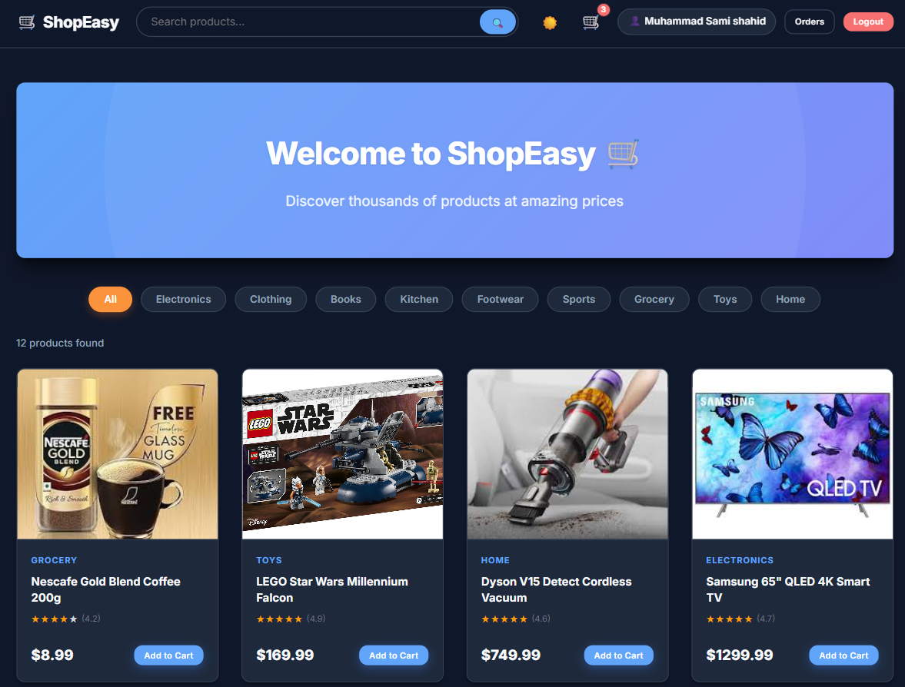
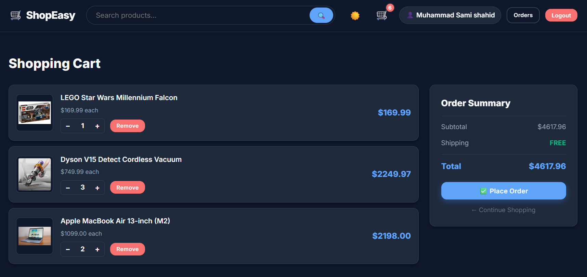
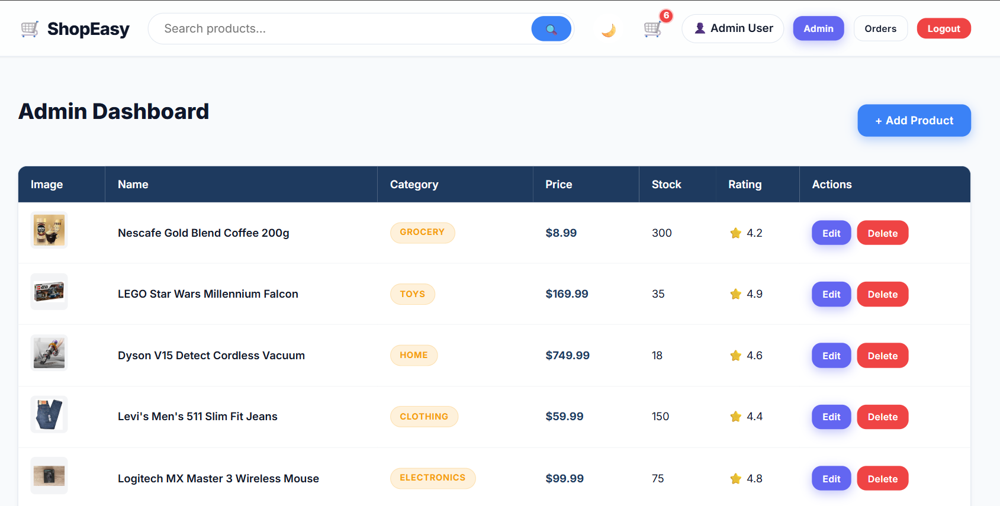

# 🛒 Full-Stack E-Commerce Web Application (Amazon Clone)


Welcome to the **Full-Stack E-Commerce Application**! This project is a modern, premium online store designed to replicate the core shopping experience of platforms like Amazon. 

It is built from the ground up using the powerful **MERN Stack** (MongoDB, Express, React, Node.js) and is completely responsive, meaning it looks beautiful on phones, tablets, and desktop computers.

Whether you are a recruiter looking at my work, or a beginner looking to learn how full-stack apps are built, this documentation will guide you step-by-step!

---

## ✨ What Does This App Do? (Features)

- **🛍️ Complete Shopping Experience:** Browse products, view detailed descriptions, and add items to your cart.
- **🌗 Light & Dark Mode:** Users can click a button in the navigation bar to switch between a bright light theme and a sleek dark theme. The website remembers your choice!
- **📱 Fully Responsive UI:** The website automatically resizes and reshapes itself to fit perfectly on any device screen.
- **🔐 User Authentication:** Users can securely sign up, log in, and log out.
- **🔔 Animated Notifications:** When you add an item to the cart, a smooth "Toast" notification drops down to confirm your action.
- **💎 Premium Glassmorphism Design:** Modern design aesthetics with blurred backgrounds, soft shadows, and hover animations.

---

## 🛠️ The Tech Stack (What It's Built With)

If you are a beginner, here is a quick breakdown of the tools used:

* **React.js & Vite (Frontend):** The user interface you see and interact with. Vite makes React incredibly fast.
* **Node.js & Express.js (Backend):** The server that handles logic, user requests, and talks to the database.
* **MongoDB & Mongoose (Database):** Where all the data (products, users, passwords) is permanently saved.
* **React Context API:** Used to remember what items are inside your Shopping Cart across different pages.

---

## 📸 Screenshots

### 1. Home Page (Product Grid)


### 2. Product Detail Page


### 3. Shopping Cart


### 4. Admin Dashboard


### 5. Add/Edit Product


---

## 🚀 Beginner-Friendly Setup Guide

Want to run this project on your own computer? Follow these easy steps!

### Step 1: Prerequisites
Before you start, you must have two things installed on your computer:
1. **[Node.js](https://nodejs.org/):** This allows your computer to run JavaScript outside of a browser.
2. **[MongoDB](https://www.mongodb.com/try/download/community):** This is the database. You can install it locally on your computer, or use a free cloud database called MongoDB Atlas.

### Step 2: Download the Code
Open your computer's terminal (or command prompt) and run:
```bash
git clone https://github.com/samishahid516/Full-Stack-E-Commerce-Web-Application-Amazon-Clone-.git
cd Full-Stack-E-Commerce-Web-Application-Amazon-Clone-
```

### Step 3: Install Backend Dependencies
The backend needs some libraries to run. Let's install them:
```bash
cd backend
npm install
```

### Step 4: Configure the Database (.env file)
The backend needs to know how to talk to your database. 
1. Inside the `backend` folder, create a new file and name it exactly `.env`.
2. Open the `.env` file in a text editor and paste the following:
```env
# Your MongoDB connection string
MONGO_URI=mongodb://127.0.0.1:27017/ecommerce-app

# The port your server will run on
PORT=5000

# A secret key used to scramble user passwords
JWT_SECRET=my_super_secret_key_123
```
*(Note: If you are using MongoDB Atlas, replace the `MONGO_URI` with your Atlas connection string).*

### Step 5: Seed the Database
Currently, your database is completely empty. "Seeding" means we will automatically inject sample products (like Headphones, TVs, Books) into the database so your store isn't empty!
Make sure you are still in the `backend` folder in your terminal, and run:
```bash
node seed.js
```
*You should see a message saying "Inserted products successfully!"*

### Step 6: Install Frontend Dependencies
Now let's get the frontend ready. Open a **new, second terminal window** and navigate to the frontend folder:
```bash
cd frontend
npm install
```

### Step 7: Start the Application!
You are finally ready! You need to keep both the backend and frontend running at the same time.

**In Terminal 1 (Backend):**
```bash
cd backend
npm start
```
*Your backend is now running on http://localhost:5000*

**In Terminal 2 (Frontend):**
```bash
cd frontend
npm run dev
```
*Your frontend is now running! Look at your terminal, it will give you a link (usually `http://localhost:3000` or `http://localhost:5173`). Click it to open the app in your browser!*

---

## 📂 Project Structure

For beginners curious about where everything is located:
- `/backend/models`: Contains the rules for how our Database saves Data (e.g., `User.js`, `Product.js`).
- `/backend/routes`: Defines the URLs that our frontend can request data from.
- `/frontend/src/components`: Reusable UI parts like the `Navbar` or `ProductCard`.
- `/frontend/src/pages`: The main screens of the app (like `Home.jsx`, `Cart.jsx`, `Login.jsx`).
- `/frontend/src/index.css`: Where all the magic happens for our global styling and Dark/Light mode!

---

**Developed with ❤️ by Muhammad Sami**
